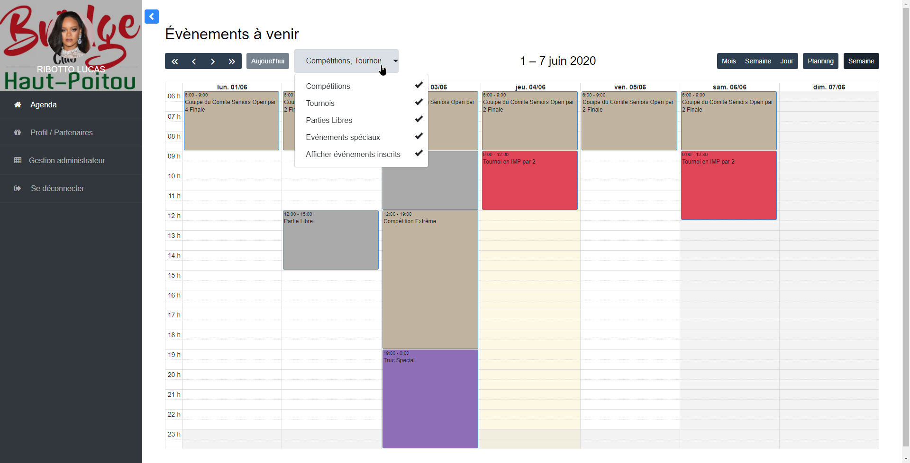

# Projet de stage (en cours): Administration du Club de Bridge du Haut Poitou

###### Début: 25/05/2020
###### Fin  : 25/06/2020

#### Synopsis
Dans le cadre d'un stage, j'ai été amené à developpé une interface qui permetterai de simplifier la vie du club. 
En effet, l'organisation des tournois, compétitions, et autres évenements se faisaient par mail et de façon humaine.
Ce fastidieux inconvenient vient trouver sa solution dans l'automatisation informatique.

#### Remarques
Une relation étroite avec les clients à été nécessaire, ne connaisant rien au bridge. Plusieurs reunions ont été entreprises, cet aspect social constitue un des points fort ce cet éxpérience.

#### Ce qui à été fait
* Authentification
* Importation d'évenements, parties libres, compétitions, tounois depuis des fichiers .csv
* Agenda, qui permet de voir les évenements, mais aussi les inspecter
* Interface d'inscription, les utilisateurs forment des paires entre eux et s'inscrivent à un évenement
* Gestion de profil, gére les favoris de l'utilisateur
* Système de mail: notification d'inscription, de desinscription
* **API sécurisé**, pour l'instant l'API ne permet que de se desinscrire à un évenement.

### Authentification

### Agenda/Index

### Gestion Profil

### Page d'import
