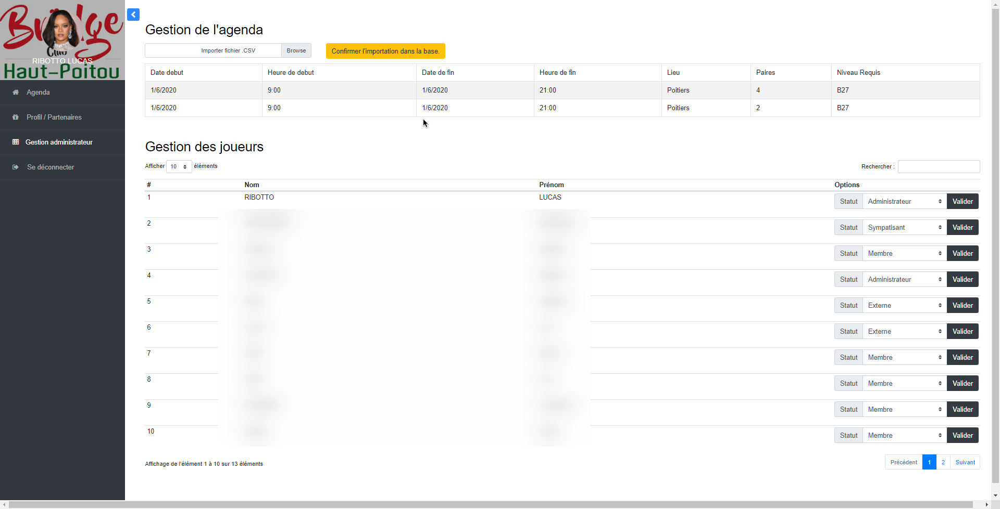

# Projet de stage (en cours): Administration du Club de Bridge du Haut Poitou

###### Début: 25/05/2020
###### Fin  : 25/06/2020

#### Synopsis
Dans le cadre d'un stage, j'ai été amené à developper une interface qui permettrait de simplifier la vie du club. 
En effet, l'organisation des tournois, compétitions, et autres évenements se faisait par mail et avec de nombreuses interventions humaines fastidieuses. Le projet qui m'a été confié propose d'automatiser informatiquement toute cette gestion quotidienne.

#### Remarques
Une relation étroite avec les clients a été nécessaire, ne connaissant rien au bridge ni à leurs contraintes de gestion. Plusieurs réunions ont donc eu lieu et cet aspect social constitue un des points fort de cette expérience.

#### Ce qui à été fait
* Authentification
* Mise en place du calendrier : Importation d'événements, parties libres, compétitions, tounois depuis des fichiers .csv
* Agenda, qui permet de voir les événements, mais aussi les inspecter
* Interface d'inscription, les utilisateurs forment des paires entre eux et s'inscrivent à un évenement
* Gestion de profil, gére les partenaires favoris de l'utilisateur
* Système de mail: notification d'inscription, de désinscription
* API sécurisée, pour l'instant l'API ne permet que de se désinscrire à un évenement.

### Authentification

### Agenda/Index

### Gestion Profil

### Page d'import

