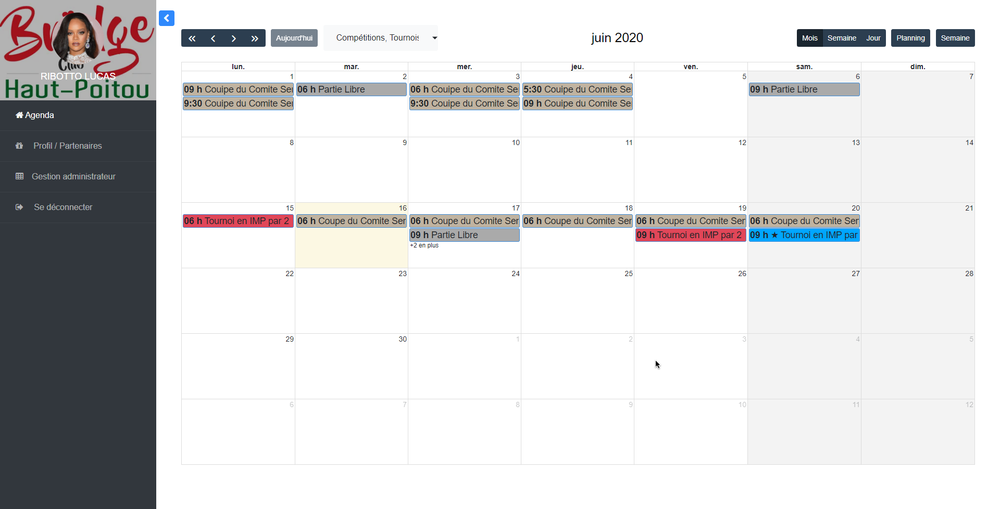

# Projet de stage (terminé): Administration du Club de Bridge du Haut Poitou

###### Début: 25/05/2020
###### Fin  : 25/06/2020
###### Relecture le 15/01/2021. Remarques: les photos documentées ne sont pas toutes à jour, toutes les fonctionnalités évoquées ne sont pas forcement présentes.

#### Synopsis
Dans le cadre d'un stage, j'ai été amené à developper une interface qui permettrait de simplifier la vie du club. 
En effet, l'organisation des tournois, compétitions, et autres évenements se faisait par mail et avec de nombreuses interventions humaines fastidieuses. Le projet qui m'a été confié propose d'automatiser informatiquement toute cette gestion quotidienne.

#### Remarques
Une relation étroite avec les clients a été nécessaire, ne connaissant rien au bridge ni à leurs contraintes de gestion. Plusieurs réunions ont donc eu lieu et cet aspect social constitue un des points fort de cette expérience.

#### Ce qui à été fait
* Authentification
* Gestion de droits pour les utilisateurs, chaque action possède requiert des droits. Des groupes peuvent être créer avec n'importe quelles permissions.
* Mise en place du calendrier : Importation et édition d'événements, parties libres, compétitions, tounois depuis des fichiers .csv
* Agenda, qui permet de voir les événements, mais aussi les inspecter
* Interface d'inscription, les utilisateurs forment des paires entre eux et s'inscrivent à un évenement
* Mise à jour automatique du contenu des pages
* Gestion de profil, gére les partenaires favoris de l'utilisateur
* Gestion du statut des joueurs par l'administrateur (adherent, etc...)
* Export de liste de participants d'un évenement en pdf/csv
* L'administrateur peut former des paires et inscrire les gens entre eux, comme les désinscrire
* Système de mail: notification d'inscription, de désinscription
* API sécurisée, pour l'instant l'API ne permet que de se désinscrire à un évenement.

### Authentification

### Agenda/Index

### Gestion d'un événement

### Inscription
#### Exemple d'évenement après avoir réalisé une inscription

#### Inscription à un tournoi, en rouge notre paire, en bleu une deuxième paire

#### Exemple inscription en compétition

#### Exemple de page d'évenements (regroupement de tournois/compétitions ou bien événement singulier...)

### Gestion Profil

### Page administrateur

#### Gestion des permissions

### Ancienne page administrateur

